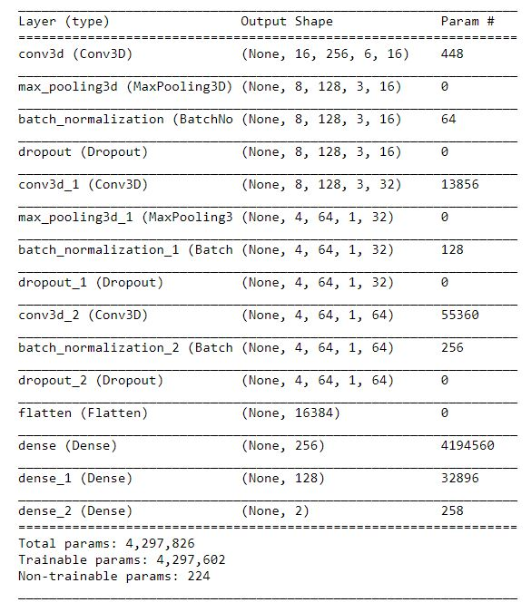
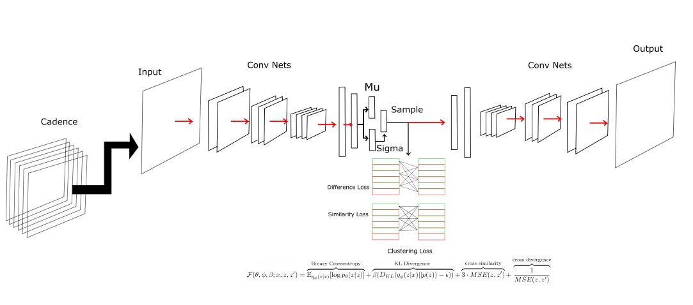

# Machine Learning Approaches 

Here are the multiple attempts at using machine learning to perform SETI searches and improve on previous false detection rates with `TurboSETI`. This document helps document these approaches and what worked and what didn't. 

## Naive Model

The first approach is a classic ML classifier. The model is trained on simulated data. The model uses a `3-D` convolutional neural network where a cadence is stacked together into a `3-D` tensor of shape `[6,16,256]` where the first index is the observation, and second index is the time dimension and third index is the frequency domain. The training set has the shape `[sample,6,16,256]` where the sample is the set of cadence. The labels of the dataset is labeled as `[1,0]` for **true** and `[0,1]` for **false**. 

Half the dataset are negatives and half are positive of `80,000` training samples. Of the positive observations each $\frac{1}{4}$ is one interval of intensity factors. One section ranges between  and `0.001 - 0.01` and `0.01-0.1` and then `0.1-1` and then `1-10`. 

The model architecture is the following: 



The training parameters uses, `Adam` optimizer using a standard learning rate of `0.001` and the labels for the dataset. 

### Issues

The issues with the model is that its very difficult to generalize to help classify a general set of cadences. When the model was tested on  real GBT data it performed well in rejecting candidates. However it failed in detecting positive signals injected. This signal is different from the trained dataset. 

# Autoencoder Model

The second approach is a much more fluid approach. We train models to encode the features which lets us computation compare the observations. The benefit is that this allow us to filter based on an arbitrary set of  restrictions meaning the same model works for both temporal cadence filtering and spatial filtering with multiple beams. The approach is no longer static like the model trained above. 

The training dataset uses filtered RFI from energy detection. The model is trained on about `650,000` observations. However the potential issue is the representation of the each RFI signal may be troubling. Since we can not control the frequency of occurrence for each RFI signal, the model will be swayed in recreating certain signals over other signals.  This makes it difficult to get the model to perform the way we expect it to. 

The model has the following architecture: 

```
_________________________________________________________________
Layer (type)                 Output Shape              Param #   
=================================================================
encoder_input (InputLayer)   [(None, 16, 256, 1)]      0         
_________________________________________________________________
conv2d_189 (Conv2D)          (None, 16, 256, 8)        80        
_________________________________________________________________
batch_normalization_180 (Bat (None, 16, 256, 8)        32        
_________________________________________________________________
conv2d_190 (Conv2D)          (None, 16, 256, 8)        584       
_________________________________________________________________
batch_normalization_181 (Bat (None, 16, 256, 8)        32        
_________________________________________________________________
conv2d_191 (Conv2D)          (None, 16, 256, 8)        584       
_________________________________________________________________
batch_normalization_182 (Bat (None, 16, 256, 8)        32        
_________________________________________________________________
conv2d_192 (Conv2D)          (None, 16, 256, 8)        584       
_________________________________________________________________
batch_normalization_183 (Bat (None, 16, 256, 8)        32        
_________________________________________________________________
max_pooling2d_36 (MaxPooling (None, 8, 128, 8)         0         
_________________________________________________________________
conv2d_193 (Conv2D)          (None, 8, 128, 64)        4672      
_________________________________________________________________
batch_normalization_184 (Bat (None, 8, 128, 64)        256       
_________________________________________________________________
conv2d_194 (Conv2D)          (None, 8, 128, 64)        36928     
_________________________________________________________________
batch_normalization_185 (Bat (None, 8, 128, 64)        256       
_________________________________________________________________
conv2d_195 (Conv2D)          (None, 8, 128, 64)        36928     
_________________________________________________________________
batch_normalization_186 (Bat (None, 8, 128, 64)        256       
_________________________________________________________________
conv2d_196 (Conv2D)          (None, 8, 128, 64)        36928     
_________________________________________________________________
batch_normalization_187 (Bat (None, 8, 128, 64)        256       
_________________________________________________________________
max_pooling2d_37 (MaxPooling (None, 4, 64, 64)         0         
_________________________________________________________________
conv2d_197 (Conv2D)          (None, 4, 64, 128)        73856     
_________________________________________________________________
batch_normalization_188 (Bat (None, 4, 64, 128)        512       
_________________________________________________________________
max_pooling2d_38 (MaxPooling (None, 2, 32, 128)        0         
_________________________________________________________________
conv2d_198 (Conv2D)          (None, 2, 32, 256)        295168    
_________________________________________________________________
batch_normalization_189 (Bat (None, 2, 32, 256)        1024      
_________________________________________________________________
max_pooling2d_39 (MaxPooling (None, 1, 16, 256)        0         
=================================================================
Total params: 489,000
Trainable params: 487,656
Non-trainable params: 1,344
_________________________________________________________________
(None, 1, 16, 256)
Model: "fullyconnected"
_________________________________________________________________
Layer (type)                 Output Shape              Param #   
=================================================================
fully_connected_inputs (Inpu [(None, 1, 16, 256)]      0         
_________________________________________________________________
flatten_9 (Flatten)          (None, 4096)              0         
_________________________________________________________________
leaky_re_lu_27 (LeakyReLU)   (None, 4096)              0         
_________________________________________________________________
dropout_36 (Dropout)         (None, 4096)              0         
_________________________________________________________________
dense_27 (Dense)             (None, 256)               1048832   
_________________________________________________________________
dropout_37 (Dropout)         (None, 256)               0         
=================================================================
Total params: 1,048,832
Trainable params: 1,048,832
Non-trainable params: 0
_________________________________________________________________
Model: "decoder"
_________________________________________________________________
Layer (type)                 Output Shape              Param #   
=================================================================
input_10 (InputLayer)        [(None, 256)]             0         
_________________________________________________________________
dense_28 (Dense)             (None, 256)               65792     
_________________________________________________________________
leaky_re_lu_28 (LeakyReLU)   (None, 256)               0         
_________________________________________________________________
dropout_38 (Dropout)         (None, 256)               0         
_________________________________________________________________
dense_29 (Dense)             (None, 4096)              1052672   
_________________________________________________________________
leaky_re_lu_29 (LeakyReLU)   (None, 4096)              0         
_________________________________________________________________
dropout_39 (Dropout)         (None, 4096)              0         
_________________________________________________________________
reshape_18 (Reshape)         (None, 1, 16, 256)        0         
_________________________________________________________________
reshape_19 (Reshape)         (None, 1, 16, 256)        0         
_________________________________________________________________
up_sampling2d_36 (UpSampling (None, 2, 32, 256)        0         
_________________________________________________________________
conv2d_199 (Conv2D)          (None, 2, 32, 256)        590080    
_________________________________________________________________
batch_normalization_190 (Bat (None, 2, 32, 256)        1024      
_________________________________________________________________
up_sampling2d_37 (UpSampling (None, 4, 64, 256)        0         
_________________________________________________________________
conv2d_200 (Conv2D)          (None, 4, 64, 128)        295040    
_________________________________________________________________
batch_normalization_191 (Bat (None, 4, 64, 128)        512       
_________________________________________________________________
up_sampling2d_38 (UpSampling (None, 8, 128, 128)       0         
_________________________________________________________________
conv2d_201 (Conv2D)          (None, 8, 128, 64)        73792     
_________________________________________________________________
batch_normalization_192 (Bat (None, 8, 128, 64)        256       
_________________________________________________________________
conv2d_202 (Conv2D)          (None, 8, 128, 64)        36928     
_________________________________________________________________
batch_normalization_193 (Bat (None, 8, 128, 64)        256       
_________________________________________________________________
conv2d_203 (Conv2D)          (None, 8, 128, 64)        36928     
_________________________________________________________________
batch_normalization_194 (Bat (None, 8, 128, 64)        256       
_________________________________________________________________
conv2d_204 (Conv2D)          (None, 8, 128, 64)        36928     
_________________________________________________________________
batch_normalization_195 (Bat (None, 8, 128, 64)        256       
_________________________________________________________________
up_sampling2d_39 (UpSampling (None, 16, 256, 64)       0         
_________________________________________________________________
conv2d_205 (Conv2D)          (None, 16, 256, 8)        4616      
_________________________________________________________________
batch_normalization_196 (Bat (None, 16, 256, 8)        32        
_________________________________________________________________
conv2d_206 (Conv2D)          (None, 16, 256, 8)        584       
_________________________________________________________________
batch_normalization_197 (Bat (None, 16, 256, 8)        32        
_________________________________________________________________
conv2d_207 (Conv2D)          (None, 16, 256, 8)        584       
_________________________________________________________________
batch_normalization_198 (Bat (None, 16, 256, 8)        32        
_________________________________________________________________
conv2d_208 (Conv2D)          (None, 16, 256, 8)        584       
_________________________________________________________________
batch_normalization_199 (Bat (None, 16, 256, 8)        32        
_________________________________________________________________
conv2d_209 (Conv2D)          (None, 16, 256, 1)        73        
=================================================================
Total params: 2,197,289
Trainable params: 2,195,945
Non-trainable params: 1,344
_________________________________________________________________
Model: "Generator"
_________________________________________________________________
Layer (type)                 Output Shape              Param #   
=================================================================
encoder_input (InputLayer)   [(None, 16, 256, 1)]      0         
_________________________________________________________________
encoder (Functional)         (None, 1, 16, 256)        489000    
_________________________________________________________________
fullyconnected (Functional)  (None, 256)               1048832   
_________________________________________________________________
decoder (Functional)         (None, 16, 256, 1)        2197289   
=================================================================
Total params: 3,735,121
Trainable params: 3,732,433
Non-trainable params: 2,688
_________________________________________________________________
```

The model was trained with the following parameters with the `Adam` optimizer with a learning rate of `1e-3` and a $\beta$ decay rate of `0.9`. 

## Issues

The issue with this model is that the feature representations are entangled and the dimensions of the latent features are too high. This is a problem because the plain autoencoder encoders latent features that are far too similar to each other. This causes the problems when we try to cluster these features. Furthermore, the features are entangled. This means that the specific characteristics of an object are not independent of each other. In a disentangled model, the individual dimension would represent a specific parameter of an object. Thus when clustering the image the cluster fails to cluster different classes.

# Disentangled $\beta-$VAE

A disentangled $\beta-$VAE is a variational autoencoder with a specific hyper parameter $\beta$ used to tune the weighting of the `KL-Divergence` factor in the loss function and when computing the backprop gradient. This single parameter helps force the neural network to learn parameters that result in the greatest difference in the recreation result in the VAE. The classic diagram for this neural network is the follwoing.


 The model architecture is the following: 

```
__________________________________________________________________________________________________
Layer (type)                    Output Shape         Param #     Connected to                     
==================================================================================================
input_1 (InputLayer)            [(None, 16, 64, 1)]  0                                            
__________________________________________________________________________________________________
conv2d (Conv2D)                 (None, 8, 32, 32)    320         input_1[0][0]                    
__________________________________________________________________________________________________
conv2d_1 (Conv2D)               (None, 4, 16, 64)    18496       conv2d[0][0]                     
__________________________________________________________________________________________________
flatten (Flatten)               (None, 4096)         0           conv2d_1[0][0]                   
__________________________________________________________________________________________________
dense (Dense)                   (None, 256)          1048832     flatten[0][0]                    
__________________________________________________________________________________________________
z_mean (Dense)                  (None, 3)            771         dense[0][0]                      
__________________________________________________________________________________________________
z_log_var (Dense)               (None, 3)            771         dense[0][0]                      
__________________________________________________________________________________________________
sampling (Sampling)             (None, 3)            0           z_mean[0][0]                     
                                                                 z_log_var[0][0]                  
==================================================================================================
Total params: 1,069,190
Trainable params: 1,069,190
Non-trainable params: 0
__________________________________________________________________________________________________
Model: "decoder"
_________________________________________________________________
Layer (type)                 Output Shape              Param #   
=================================================================
input_2 (InputLayer)         [(None, 3)]               0         
_________________________________________________________________
dense_1 (Dense)              (None, 256)               1024      
_________________________________________________________________
dropout (Dropout)            (None, 256)               0         
_________________________________________________________________
dense_2 (Dense)              (None, 4096)              1052672   
_________________________________________________________________
dropout_1 (Dropout)          (None, 4096)              0         
_________________________________________________________________
reshape (Reshape)            (None, 4, 16, 64)         0         
_________________________________________________________________
conv2d_transpose (Conv2DTran (None, 8, 32, 64)         36928     
_________________________________________________________________
conv2d_transpose_1 (Conv2DTr (None, 16, 64, 32)        18464     
_________________________________________________________________
conv2d_transpose_2 (Conv2DTr (None, 16, 64, 1)         289       
=================================================================
Total params: 1,109,377
Trainable params: 1,109,377
Non-trainable params: 0
```

The training parameters used the `Adam` optimizer and the the learning rate was set to `3e-3`. The dataset trained was specifically curated from the original `Naive Model` which made use of the dataset but removed a row of the data. The row contained a bright line which beams throughout a majority of the dataset. Removing that would make the training better and helps it generalize to other observations as well. 

# Disentangled $\beta-$VAE Embedded Clustering

Despite the incredible ability for the neural network to learn these features we want to inherently maximize the neural networks ability to separate the features. We do so by adding an additional loss function called the cross similarity and cross divergence loss function specific to the structure of the cadences we wish to cluster. 

The network works the same as the disentangled VAE above but theres an extra loss function. We describe the following: 



We can describe the following: loss function 
$$
\mathcal{F}(\theta,\phi,\beta; x,z,z') = \overbrace{\mathbb{E}_{q_\phi(z|x)}[\log p_\theta(x|z)]}^{\text{Binary Crossentropy}} + 
\overbrace{\beta (D_{KL}(q_\phi(z|x)||p(z))-\epsilon))}^{\text{KL Divergence }} + 
\overbrace{3\cdot \Lambda_S(z,z')}^{\text{cross similarity}} + \overbrace{\Lambda_{D}(z,z')}^{\text{cross divergence}}
$$
We can define the similarity function and the divergence function with the following:
$$
\Lambda_S(z,z')= \begin{cases}
-(z-z')[(z-z')-2], & \text{if } z-z'<1\\
(z-z')^2, & \text{if } z-z'\geq 1\\
\end{cases}
$$


