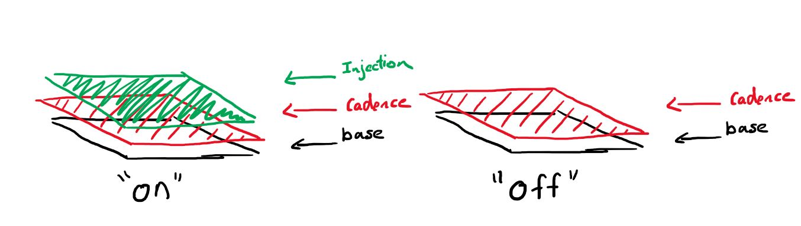
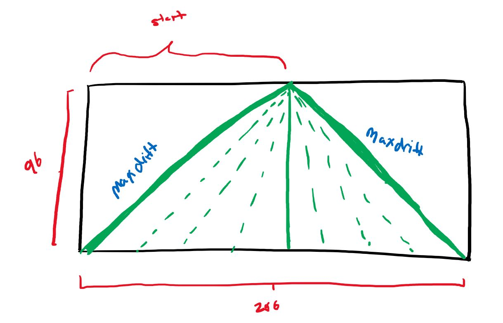
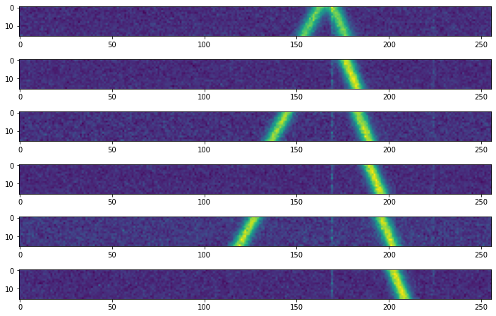
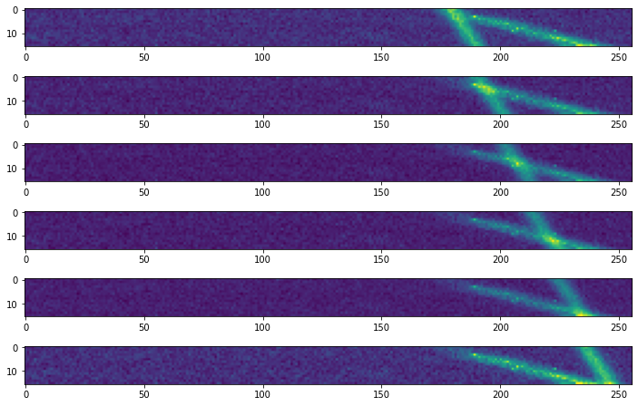

# Cadence Tests 🧪

This notes page is dedicated to documenting a test bench for generating synthetic signals that simulate SETI events. It relies on `SETIGEN` and previously filtered RFI from GBT data. 

The Cadence Pattern we will be looking for is the typical 6 observation length of ABACAD. Here is how to generate such patterns. 

[<<< BACK](directory.html) 

# Layers

For each of our simulated cadences we create them by layering signals on top of each other. The following diagram shows just that:



The goal is to create a realistic simulation by first, taking a `base` layer which contains real RFI signals from GBT. Then we inject our own RFI using `SETIGEN` with a known drift rate. We then inject a SETI signal on top. We layer them together and add it up. 

**Note:** The reason why we dont use `base` directly in generating SETIGEN on top versus adding them is because we need RFI to drift across multiple frames. We also need to control where the SETI signal is in relation to the RFI signal. 

# Base Plate Layer

Firstly our synthetic data requires existing observations to fill the empty space. Specifically want want previously detected RFI signals. `Energy Detection ` results contain good examples of RFI snippets that we can use as the base plate for a cadence. We can access such datasets via the following links:

```code

```

We will be using `Fine` resolution files because we'd like to replicate a realistic SETI event. 

# Synthetic RFI Layer - Cadence

Now that we've loaded the base layer we can then add the synthetic RFI signal. We will create our signal with the following function. 

```python
def new_cadence(mean = 58348559, snr_power = 1):
    snr=(random()*10+200)
    start = int(random()*126)+100
    if (-1)**(int(random()*3+1)) > 0:
        true_slope = (96/start)
        slope = (true_slope)*(18.25361108/2.7939677238464355)+random()*10
    else:
        true_slope = (96/(start-256))
        slope = (true_slope)*(18.25361108/2.7939677238464355)-random()*10
    drift= -1*(1/slope)
    b = 96-true_slope*(start)
    frame = stg.Frame(fchans=256*u.pixel,
                    tchans=16*6*u.pixel,
                    df=2.7939677238464355*u.Hz,
                    dt=18.25361108*u.s,
                    fch1=6095.214842353016*u.MHz)
    noise = frame.add_noise(x_mean=mean, noise_type='chi2')
    signal = frame.add_signal(stg.constant_path(f_start=frame.get_frequency(index=start),
                                              drift_rate=drift*u.Hz/u.s),
                            stg.constant_t_profile(level=frame.get_intensity(snr=snr)),
                            stg.gaussian_f_profile(width=20*u.Hz),
                            stg.constant_bp_profile(level=1))
    return frame.data, true_slope, b
```

This code is not very readable. We can trace through the logic. 

1. We get a random `SNR` value. 

2. We get a random `start` value where the signal starts. [convention follows where signal start at the top]

3. Then we compute `drift` rate to use

   1. Since we don't want the signal to drift OUT of the frame, we compute the maximum slope the line can have before it drifts out. 

      

      1. First we randomly choose **backward drift** or **forward drift**

      2. Next we compute the max **Pixel** **slope** which is calculated either 
         
         1. $m = \frac{\Delta y}{\Delta x} = \frac{96}{\text{start}}$
         
            1. ```code
               true_slope = (96/start)
               ```
         
         2. $m = \frac{\Delta y}{\Delta x} = \frac{96}{\text{start-end}}$
         
            1. ```code
               true_slope = (96/start-256)
               ```
         
      3. Create a **<u>random</u> Drift slope** that is within these bounds. 

         1. We need to convert pixel slope into drift slope

            1. $\text{drift} = m \cdot \frac{dt}{df} = m\cdot \frac{18.25361108}{2.7939677238464355} $

         2. ```python
            # positive slope
            slope = (true_slope)*(18.25361108/2.7939677238464355)+random()*10
            ```

         3. ```python
            # negative slope
            slope = (true_slope)*(18.25361108/2.7939677238464355)-random()*10
            ```

      4. Convert to proper **drift rate** convention.

         1. We then convert the drift rate convention by making it $\frac{df}{dt}$ and make it negative to the pixel slope.

         2. ```python
            drift= -1*(1/slope)
            ```

   2. After computing the proper **drift rate** we can then calculate the intercept value for the slope. This pixel value is strictly related to the **PIXEL** representation of the line. 

      1. $b = 96-\text{true slope}\cdot (start)$

   3.  We use all this information to generate a proper frame. 

      1. ```python
             frame = stg.Frame(fchans=256*u.pixel,
                             tchans=96*u.pixel,
                             df=2.7939677238464355*u.Hz,
                             dt=18.25361108*u.s,
                             fch1=6095.214842353016*u.MHz)
             noise = frame.add_noise(x_mean=mean, noise_type='chi2')
             signal = frame.add_signal(stg.constant_path(f_start=frame.get_frequency(index=start),
                                                       drift_rate=drift*u.Hz/u.s),
                                     stg.constant_t_profile(level=frame.get_intensity(snr=snr)),
                                     stg.gaussian_f_profile(width=20*u.Hz),
                                     stg.constant_bp_profile(level=1))
         ```

      2. The above was taken from SETIGEN docs

   4. This completes the generation of a valid signal! 


# SETI Signal Layer - Injection

When creating the `SETI` signal we can reuse the exact same function was we had above, however we'd intersplice the signal between cadences which we can control. **HOWEVER** we need to make sure these signals don't collide. In other words we need to make sure the RFI signal doesn't intercept with the SETI signal. This is because if it did intercept then that frame would have no means of distinguishing if there were a transient signal to begin with. To avoid this intersection we have the following function. 

```python
def intersection(m1,m2,b1,b2):
    solution = (b2-b1)/(m1-m2)
    y = m1*solution+b1
    if y>=80 and y<=96:
        return False
    elif y>=64 and y<=80:
        return False
    elif y>=32 and y<=48:
        return False
    elif y>=0 and y<=16:
        return False
    else:
        return True
```

We know that for 2 lines we can compute where they intercept. Simple math shows that: $$x = \frac{b_2-b_1}{m_1-m_2}$$ we know that this gives a **x - pixel** solution. To find the intersection we sub it back in. $y = m_1 \frac{b_2-b_1}{m_1-m_2} + b_1 $. We need to make sure that this value doesn't appear in the intervals in which a SETI signal is present! 

Thus each time we create an RFI signal and a SETI signal we check if they are valid, if not we regenerate a signal. 

```python
while True:
    cadence, m1,b1 =  new_cadence(mean = abs(np.mean(base)))
    injection_plate, m2, b2=  new_cadence(mean = abs(np.mean(base)))
    if m1!=m2:
        if intersection(m1,m2,b1,b2):
            break
```

# Putting It Together

Now we can combine these signals. **However** when we write these tests we want to be able to tune the **difficulty** and intensity **factor** of the tests. In other words we want to be able to tune the relative intensity the RFI signal is in respect to the SETI signal. Thus we introduce a `factor` parameter that lets us do such a thing. Here is the full function. The `difficulty` parameter stands for how intense the signal is relative to the background `base` plate. 

```python
def create_true(plate, difficulty=10, factor=1):
    #pick a random base plate
    index = int(plate.shape[0]*random())
    total = np.zeros((6,plate.shape[1],plate.shape[2] ))
    base = plate[index,:,:]
    
    power = math.log(abs(base.max()))/ math.log(abs(np.mean(base)))
    #check intersection 
    while True:
        cadence, m1,b1 =  new_cadence(mean = abs(np.mean(base)))
        injection_plate, m2, b2=  new_cadence(mean = abs(np.mean(base)))
        if m1!=m2:
            if intersection(m1,m2,b1,b2):
                break
    # Insert the injection 
    cadence =  cadence**(power)/difficulty*factor  
    
    injection_plate=  injection_plate**(power)/difficulty
    total[0,:,:] = cadence[0:16,:]+base + injection_plate[0:16,:]
    total[1,:,:] = cadence[16:32,:]+base 
    total[2,:,:] = cadence[32:48,:]+base + injection_plate[32:48,:]
    total[3,:,:] = cadence[48:64,:]+base 
    total[4,:,:] = cadence[64:80,:]+base + injection_plate[64:80,:]
    total[5,:,:] = cadence[80:96,:]+base 
    return total
```

Notice that we intersplice the injection in the following means. 

# Running Test 

We can run a simulation of this test. Here is an example of such a run. 

```python
%matplotlib inline
cadence = create_true(plate, difficulty=1, factor=1)
f, axarr = plt.subplots(6,1,figsize=(12,8)) 
for i in range(6):
    axarr[i].imshow(cadence[i,:,:])
```

This will generate the following plots:




# False Signals

We can also create other false signals as such: this is easier since it only involves one RFI signal. 

```python
def create_false(plate, difficulty=10, factor=1):
    index = int(plate.shape[0]*random())
    total = np.zeros((6,plate.shape[1],plate.shape[2] ))
    base = plate[index,:,:]
    power = math.log(abs(base.max()))/ math.log(abs(np.mean(base)))
    cadence, m1,b1 =  new_cadence(mean = abs(np.mean(base)))
    cadence =  cadence**(power)/difficulty*factor  
    

    total[0,:,:] = cadence[0:16,:]+base 
    total[1,:,:] = cadence[16:32,:]+base 
    total[2,:,:] = cadence[32:48,:]+base 
    total[3,:,:] = cadence[48:64,:]+base 
    total[4,:,:] = cadence[64:80,:]+base 
    total[5,:,:] = cadence[80:96,:]+base 
    return total
```

This makes the following plots:



# Extended - Multibeam

We can extend this example of a single beam to multiple beams! In the case of multiple beams we can simplify the process. Instead of temporally changing the signals, we can instead spatially change the signal. When spatially changing the signals, the result would be a change in intensity in the frequency domain. Thus we can reuse 90% of the code for single beam in replace for multibeam. 


# Beam Creation

Lets say we have **64 beams**, we have a single signal that's RFI that shows up on all observations but these observations registers different intensities. Thus we can simulate these different intensities by creating a single RFI and then adding varying intensities scaled by some random number sampled from a gaussian distribution. Here is an example:

```python
for i in range(total.shape[0]):
    total[i,:,:] = cadence + base
    total[i,:,:] =  total[i,:,:] *gauss(100, math.sqrt(50))
```

Then when we want to add in the SETI signal we can do such easily by just adding it in

```python
total[0,:,:] =total[0,:,:]  +injection_plate[0:16,:]
```

The final function you get is:

```python
def create_true(plate, factor=1):
    index = int(plate.shape[0]*random())
    total = np.zeros((64,plate.shape[1],plate.shape[2] ))
    base = plate[index,:,:]
    power = math.log(abs(base.max()))/ math.log(abs(np.mean(base)))
    
    cadence =  new_cadence(mean = abs(np.mean(base)))**(power)*factor
    for i in range(total.shape[0]):
        cadence = cadence *gauss(100, math.sqrt(50))
        total[i,:,:] = cadence[0:16,:]
    
    injection_plate =  new_cadence(mean = abs(np.mean(base)))**(power)*100
    total[0,:,:] =total[0,:,:] + injection_plate[0:16,:]
    
    return total
```

## False Signals

To create false signals the similar logic is applied:

```python
def create_false(plate, factor=10):
    index = int(plate.shape[0]*random())
    total = np.zeros((64,plate.shape[1],plate.shape[2] ))
    base = plate[index,:,:]
    power = math.log(abs(base.max()))/ math.log(abs(np.mean(base)))
    cadence =  new_cadence(mean = abs(np.mean(base)))**(power)*factor*(random()*10)
    for i in range(total.shape[0]):
        cadence = cadence *gauss(100, math.sqrt(50))
        total[i,:,:] = cadence[0:16,:]
    return total
```


[<<< BACK](directory.html)